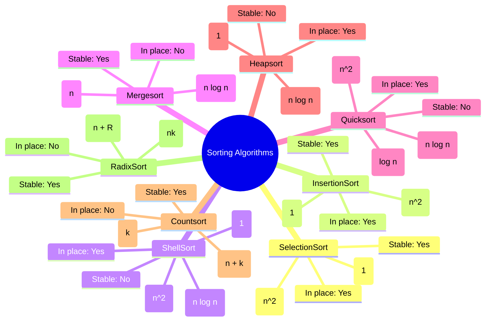

# Comparison of sorting algorithms

```mermaid
mindmap
  root((Sorting Algorithms))
    SelectionSort
        Time Complexity: O(n^2)
        Space Complexity: O(1)
        In place: Yes
        Stable: Yes
    InsertionSort
        Time Complexity: O(n^2)
        Space Complexity: O(1)
        In place: Yes
        Stable: Yes
    ShellSort
        Average Time Complexity: O(n log n)
        Worst-case Time Complexity: O(n^2)
        Space Complexity: O(1)
        In place: Yes
        Stable: No
    Mergesort
        Time Complexity: O(n log n)
        Space Complexity: O(n)
        In place: No
        Stable: Yes
    Quicksort
        Average Time Complexity: O(n log n)
        Worst-case Time Complexity: O(n^2)
        Space Complexity: O(log n)
        In place: Yes
        Stable: No
    Heapsort
        Time Complexity: O(n log n)
        Space Complexity: O(1)
        In place: Yes
        Stable: No
    Countsort
        Time Complexity: O(n + k)
        Space Complexity: O(k)
        In place: No
        Stable: Yes
    RadixSort
        Time Complexity: O(nk)
        Space Complexity: O(n + R)
        In place: No
        Stable: Yes
```
